#GRASS GIS 7 intro

###Session Objectives
* Database structure of GRASS GIS
* About the course data set
* First steps in using GRASS GIS 7
 + the graphical user interface (GUI)
   - displaying raster and vector maps
   - querying maps
   - adding map elements
   - bmap swiping with two different Landsat coverages
   - bivariate scatterplots
 + GRASS GIS command structure
   - command line or GUI?
 + Creating a perspective view
___
___
##GRASS GIS Database concept
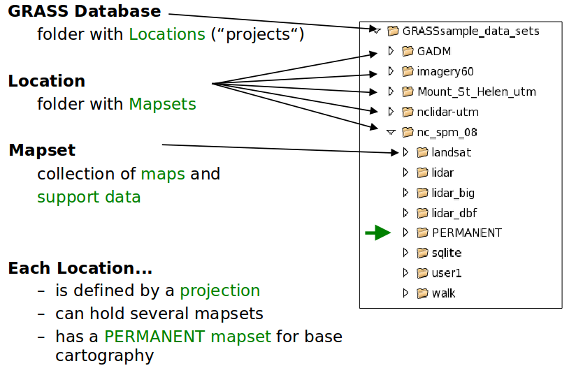

___
#####graphical view
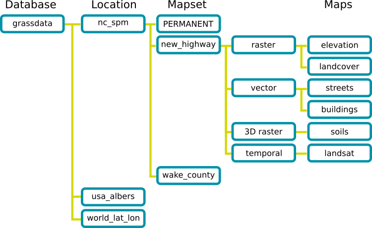

… effectively a tree of subdirectories.

GRASS GIS is a multi-user system when storing “**grassdata**” on a network drive.
Users can share “**locations**” and manage therein own “**mapsets**“ for the data.

GRASS GIS will do the file management for you!
___
####Standard GIS formats versus GRASS 7 Database

|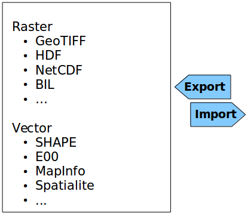|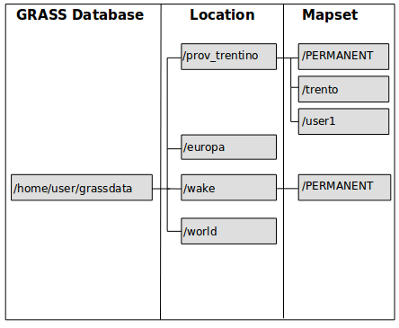|
| -------------         | ------------- |
|Data in **standard GIS** formats.|Data in **GRASS GIS** formats.|
|Store in directory:|Store in directory:|
|/home/user/**gisdata**/|/home/user/**grassdata**/|
|or a shared network directory|or a shared network directory|

___
##<span style="color:red">*Exercise*</span>- GRASS startup and first steps
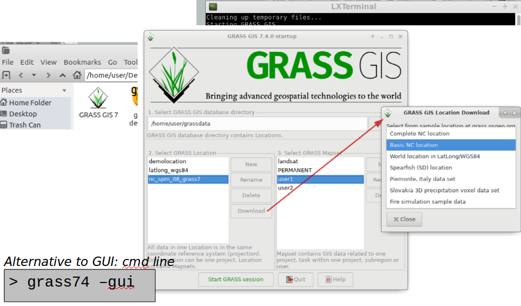
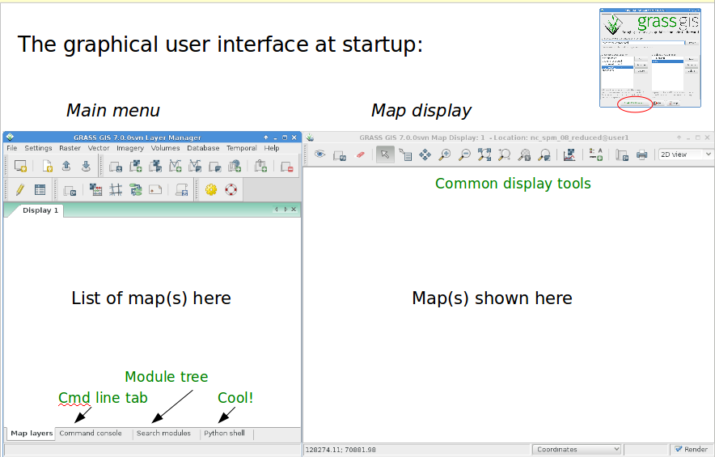

___
###Displaying raster and vector maps
A) Using the **menu**

B) Using the **icons**
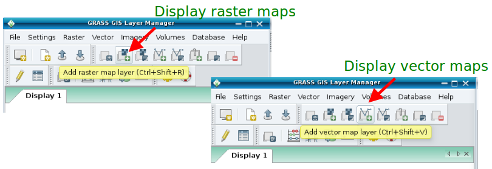

___
###Display the “roadsmajor” vector map
+ Load the “roadsmajor” vector map into the canvas, zoom to map if needed:
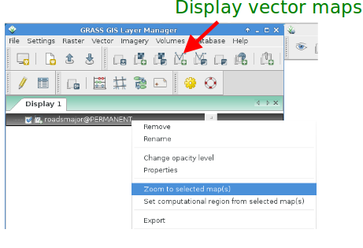


___
###Show vector map attributes
Open the attribute table of the “**roadsmajor**” vector map by
* … either right-mouse clicking in layer tree on map name
* … or using the related “Show Attribute table” icon
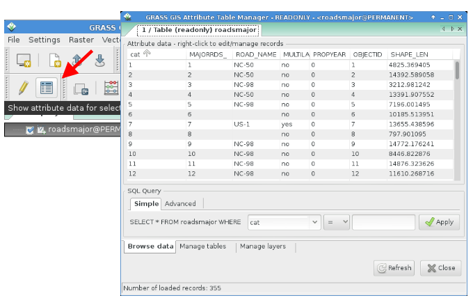

___
###Adding map elements
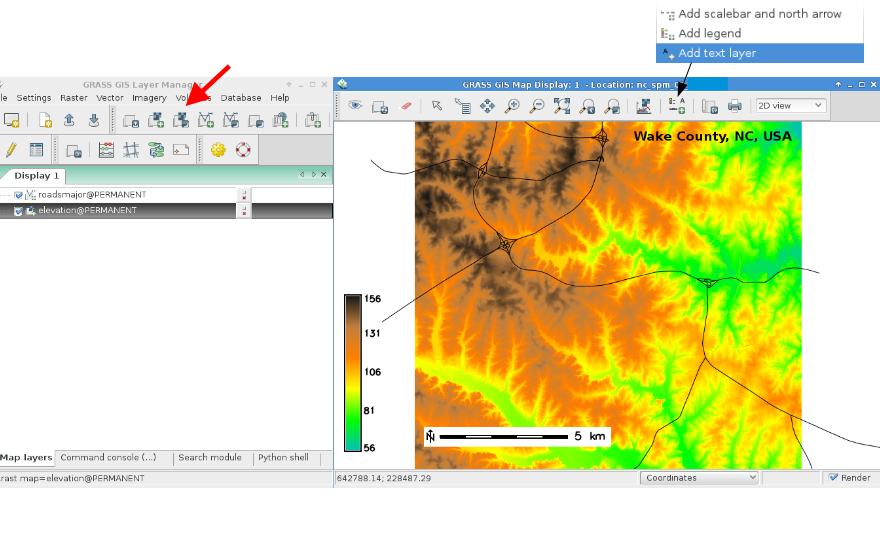

___
###Modify element settings and position
Using the Wake county “**elevation**” and “**roadsmajor**” maps:
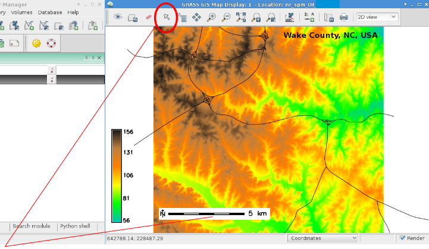
Use **pointer** to
- move map elements
- edit element settings with  a click

___
###Map histogram tool
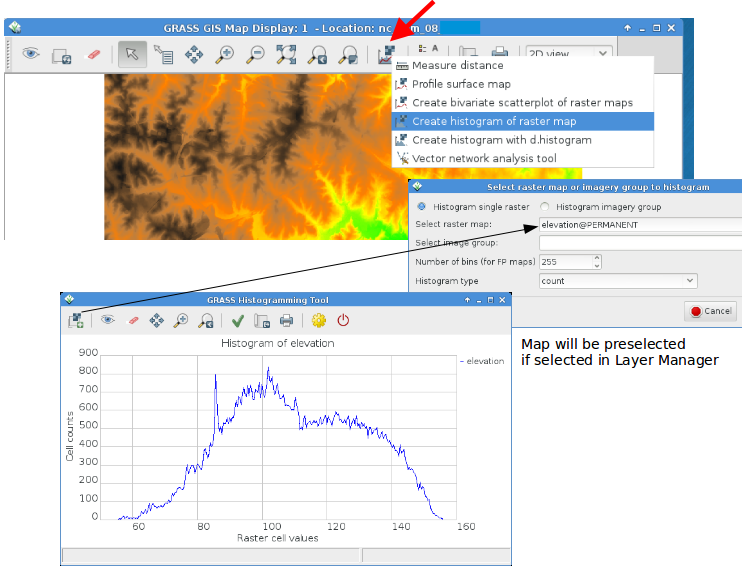


___

###Adding a Lat-Long grid to the map
Using the NC state “**elev_state_500m**” map:
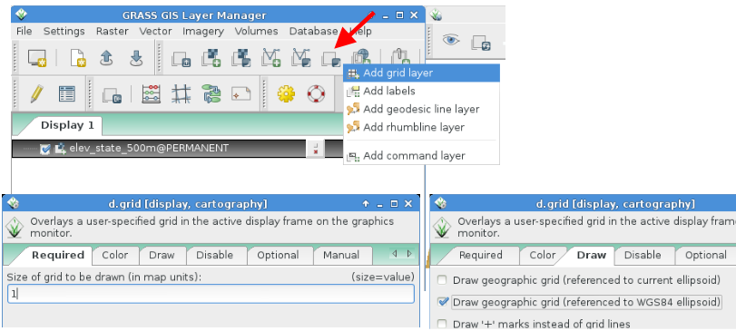
Select a grid size in grid unts (here: LL – 1 deg)	→ 	Draw grid as LatLong WGS84 grid
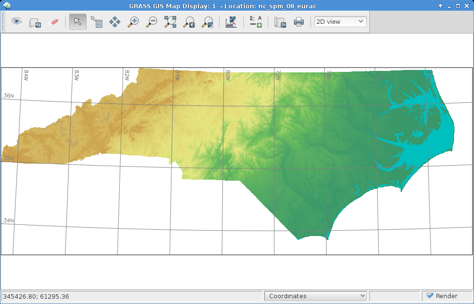

___

###Map swiping for multitemporal maps
Load the LANDSAT 5 (1987) and 7 (2002) **RGB composites** of Wake county:
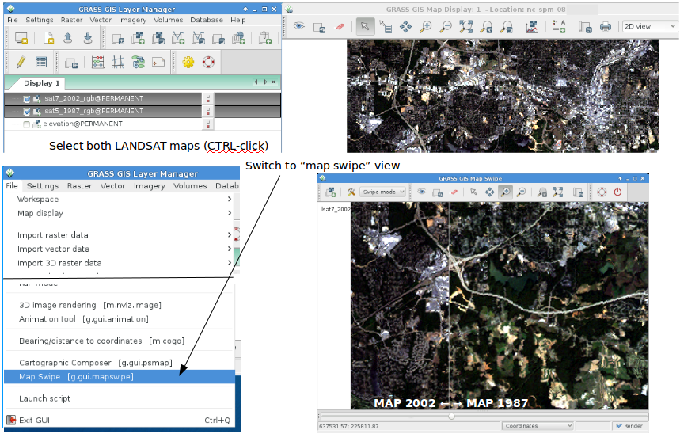

___
###Bivariate Scatterplots
Load the LANDSAT 7 2002 channels 1 and 3 of Wake county.
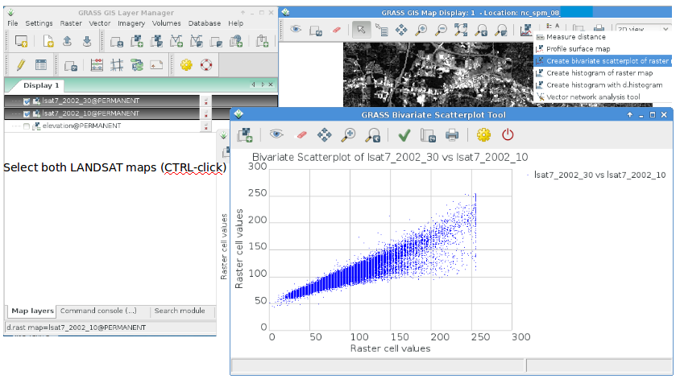

___
___
##<span style="color:red">*Overview*</span>: GRASS GIS command structure
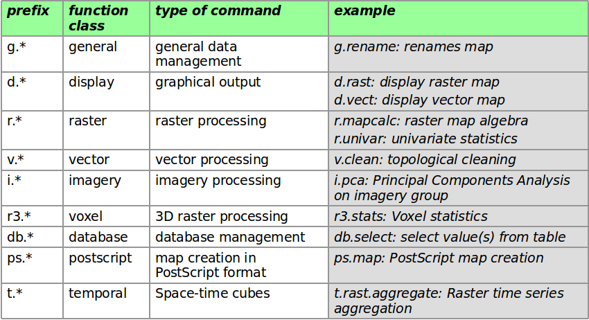

<span style="color:green">*Ninja Trick*</span>, type the desired prefix (e.g. v.) and then <tab><tab> to complete the command name

___
###GRASS startup and first steps
**Know where you are...**
get projection information for the North Carolina Location
command: **g.proj**

  
        wxGUI: Settings → Map projections → Manage projections


get projection information for the North Carolina sample data set:


|type | name|description|
| -------------| ------------- |
|name       :| Lambert Conformal Conic |Projection name|
|proj       : |lcc| projection|
|datum      :| nad83|geodetic datum|
|a          :|6378137.0| ellipsoid GR80|
|es         :| 0.006694380022900787|ellipsoid GR80|
|lat_1      :| 36.16666666666666|standard parallels|
|lat_2      :| 34.33333333333334|standard parallels|
|lat_0      :| 33.75|reference latitude|
|lon_0      :| -79|reference longitude|
|x_0        :| 609601.22|} lon and lat shifts... |
|y_0        :| 0|...(false easting/northing)|
|units      :| meters| unit |


___
###Graphical user interface versus Command line
+ GRASS GIS offers a graphical user interface


+ On command line, there is (text) help:
    
        r.univar --help


   * There are flags (e.g. -g ) and parameters (e.g. map= )


+ From command line, you can open the module's GUI (just call the command without parameters)

        r.univar --ui

+ … or generate a Python script template

       r.univar --script

**STYLE**: Menu: Settings → GUI Settings → Appearance → Module dialog style: Basic top/left
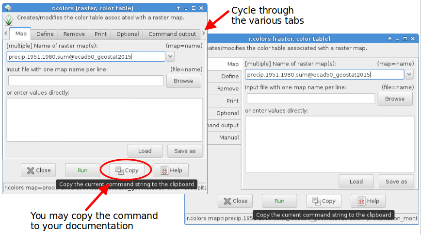
The graphical user interface effectively generates the respective command for the command line (and also writes to the shell “history”)

___
####Command line at its best
**Advantages of the command line**


+ Run “history” to see all your previous commands, “forever”

+ History is stored individually per MAPSET (note that the history of each map is stored within the map's metadata, for this use r|r3|v.info)

+ Search in history with CTRL-R

+ Save it to a file:

``` history > my_protocol.sh``` 


+ Note for Windows users: no history command but
```  “Command console” tab → “Log file”``` 
+ Polish protocol file, use “# comment” to annotate it

+ Rerun such a protocol file in a later GRASS GIS session with 

``` sh my_protocol.sh ```

Note: a simplified command line is included in the graphical user interface, tab “Command console”.

It offers a “Command prompt protocol” button.


+ These script will work for decades...
___
##<span style="color:red">*Exercise*</span> Perspective view
Load the Wake county “elevation” map (this tool requires OpenGL support):

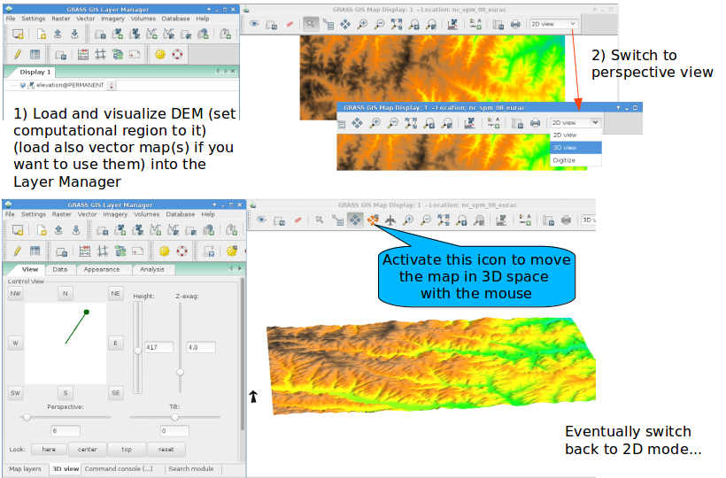


