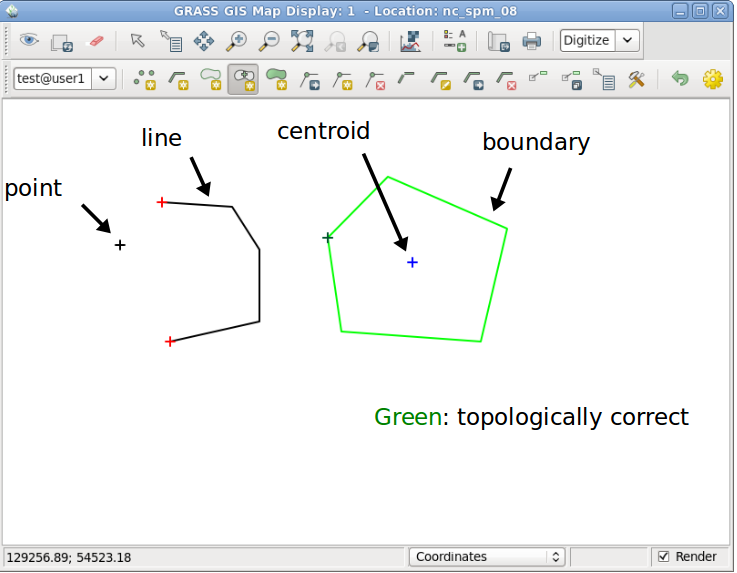
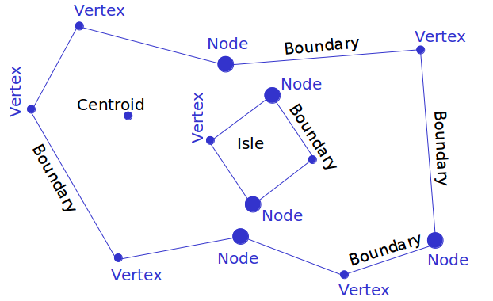
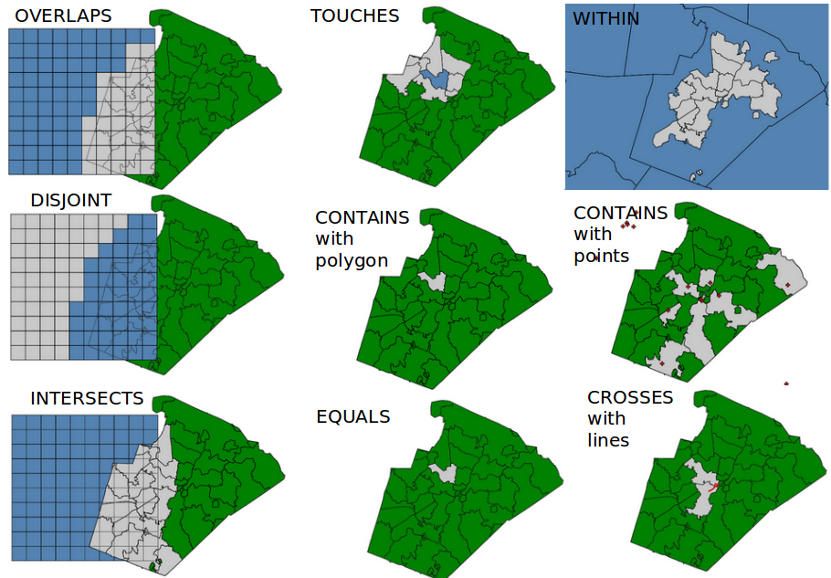
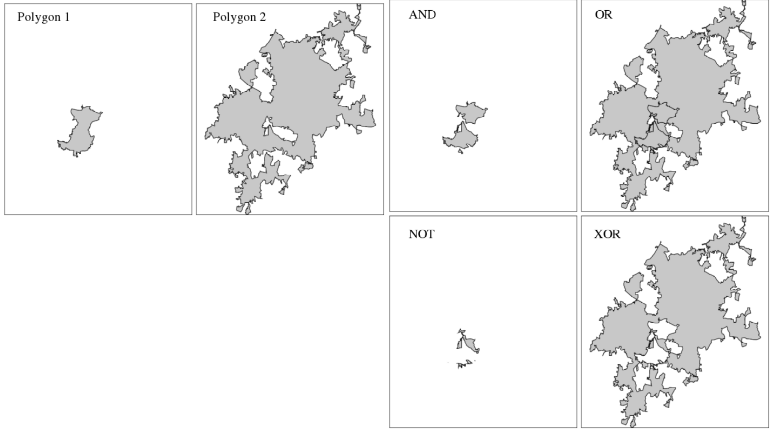
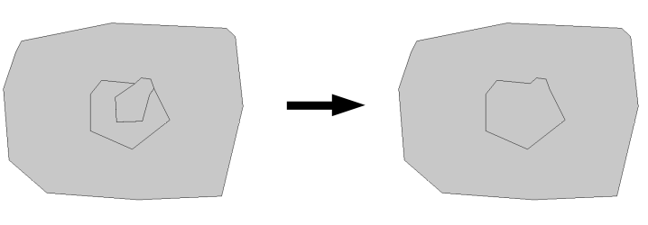

#Introduction to vector data in G7


###Session Objectives
+ Why a topological vector data model
+ Topological vector data model in GRASS GIS 7
+ Vector feature extraction
+ Vector geometry dissolving
+ Geometry editing/digitizing
+ Import/export
+ Capabilities of GRASS GIS' vector engine
___
___
##What is vector topology?

**Non-topological** vector formats:

E.g. OGC Simple Features, ESRI shapefiles

Geometry types: points, lines, polygons

→ Problem: replicated boundaries for adjacent areas


Faster computations, but extra work for maintenance

**Non-topological** polygon map being generalized

(all polygons are treated independently, leading to potentialerrors)

___
##GRASS GIS 7 Vector features

**Native vector format**
+ Vector topology
+ m:n mapping of geometry features to attributes
+ Support of vector layers
+ OGC Simple Features ←→ Topological Vector Conversion
+ [Database Management system](https://grasswiki.osgeo.org/wiki/Vector_Database_Management) (DBMS) with SQL support
+ SQLite (default DB backend), PostgreSQL + PostGIS, MySQL, ODBC (, DBF)

___
##GRASS GIS Vector model

**Vector geometry types**
* Point
* Centroid
* Line
* Boundary
* Area (boundary + centroid)
* face (3D area)
* [kernel (3D centroid)]
* [volumes (faces + kernel)]

* Geometry is true 3D when: x, y, z

___
###Basic geometry types (1)

**Basic** geometry types, they can be edited **directly**:

+ Point
+ Centroid
+ Line
+ Boundary

A GRASS vector map can contain a combination of several different types


___
###Derived geometry types (2)
**Derived** geometry types, constructed from basic types
+ Area (closed ring of boundaries + centroid)
+ Isle (closed ring of boundaries, no centroid)
+ Node (at both ends of lines/boundaries)

Isles and Nodes are not visible to the user



___
###GRASS GIS topological vector digitizer


___
___
##<span style="color:red">*Exercise*</span>: Vector feature extraction

####**Extract by attributes**

*GRASS GIS module:*


``` v.extract ```

Input: *boundary_county*

Output: *boundary_wake*


**Command:**

    v.extract input=boundary_county \
            output=boundary_wake \
            where="NAME = 'WAKE'"

___
##Vector feature select operations: v.select (GEOS)



##<span style="color:red">*Exercise*</span>: Vector feature extraction

####**Extract with another vector** (selecting full vector)

*GRASS GIS module:*


``` v.select ```

Input: *boundary_wake, railroads*

Output: *railroads_wake*

**Command:**

    v.select ain=railroads bin=boundary_wake\
             out=railroads_wake atype=line \
             btype=area operator=overlap

___
###Vector feature overlay operations
**Boolean operators**

*GRASS GIS module:*

``` v.overlay ```




####**Extract with another vector** (clipping vector)

*GRASS GIS module:*


``` v.overlay ```

Input: *boundary_wake, railroads*

Output: *railroads_wake_clip*

**Command:**

    v.overlay ain=railroads bin=boundary_wake \
              out=railroads_wake_clip atype=line \
              btype=area operator=and

*try* ```operator=not```

___
####Dissolving vector boundaries

Combination of several areas into one area based on common categories or attributes

*Dissolving common boundaries between the two interior areas:*



##<span style="color:red">*Exercise*</span>: Vector feature extraction

####Dissolving with categories

*GRASS GIS module:*


``` v.dissolve ```

Input: *boundary_county*

Output: *nc_boundary*

**Command:**

    v.category in=boundary_county type=centroid \
               out=boundary_county_cat2 layer=2 \
               cat=1 step=0 option=add

    v.db.addtable map=boundary_county_cat2 layer=2

    v.dissolve in=boundary_county_cat2 \
               out=nc_boundary layer=2 column=cat

___
###GRASS GIS topological vector digitizer


___
##GRASS Vector data exchange

**Import of vector maps**
+ v.in.ogr module
+ <span style="color:blue">v.import</span> (it also offers reprojection on the fly)!

+ Always the <span style="color:red">full</span> map is imported.


**Export of raster maps**
+ mv.out.ogr module

+ Always the <span style="color:red">full</span> map is exported.


+ OGR supported > **80** vector formats

**Creating a map from Spreadsheet file (MS Excel file, OpenDocument ODS, CSV file):**

A new vector point map can be directly created from a selected sheet in a spreadsheet:

the z coordinate is optional

    v.in.db table=List1 x=long y=lat z=height \
			output=meteodata \
			driver=ogr datatabase=meteodata.xls

Note that in this example the key option is omitted (so the key column is then automatically added)

___
##Vector capabilities

**Example vector module groups**

Topological geometry feature digitizing/editing
		
[LiDAR analysis](http://grasswiki.osgeo.org/wiki/LIDAR)

[Linear referencing (LRS)](http://grasswiki.osgeo.org/wiki/Linear_Reference_System) – v.lrs.*:

[Network analysis](http://grasswiki.osgeo.org/wiki/Vector_network_analysis) – v.net.*:


